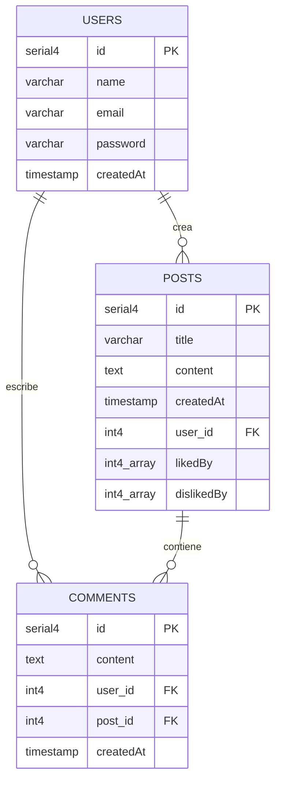

# MindFactory Posts

Este proyecto es una aplicación web full-stack diseñada para la creación y gestión de publicaciones (Posts) e interacción entre usuarios mediante comentarios. Utiliza una arquitectura moderna separando el Backend (NestJS) y el Frontend (React + Vite).

🔗 **[Ver Documentación Integral Detallada](https://deepwiki.com/omanias/MindFactory-Posts/1-overview)**

## 🚀 Funcionalidades Principales

La aplicación permite a los usuarios interactuar de la siguiente manera:

*   **Autenticación y Usuarios:**
    *   Registro e inicio de sesión seguro (JWT).
    *   Gestión de perfil de usuario.
*   **Publicaciones (Posts):**
    *   Crear, leer, actualizar y eliminar publicaciones.
    *   Interacción social: Dar "Me gusta" (Like) o "No me gusta" (Dislike) a las publicaciones.
*   **Comentarios:**
    *   Los usuarios pueden comentar en las publicaciones para generar discusión.
*   **Experiencia de Usuario (UX/UI):**
    *   **Modo Oscuro:** Interfaz con soporte para cambio de tema (Claro/Oscuro).
    *   **Diseño Responsive:** Adaptable a todo tipo de dispositivos (Móviles, Tablets y Escritorio).

## 🛠️ Tecnologías Implementadas

### Backend
*   **Framework:** [NestJS](https://nestjs.com/) (Node.js).
*   **Lenguaje:** TypeScript.
*   **Base de Datos:** PostgreSQL.
*   **ORM:** TypeORM.
*   **Autenticación:** Passport y JWT.
*   **Logging:** Winston (Registro de logs en consola y archivos).
*   **Documentación API:** [Swagger](https://swagger.io/) (Interfaz interactiva para endpoints).

### Frontend
*   **Framework:** [React](https://react.dev/) con [Vite](https://vitejs.dev/).
*   **Lenguaje:** TypeScript.
*   **Estilos:** Tailwind CSS.
*   **Routing:** React Router DOM.
*   **Cliente HTTP:** Axios.

### Infraestructura
*   **Contenedores:** Docker y Docker Compose (para la persistencia de datos con PostgreSQL).

## 📊 Diagrama de Base de Datos

A continuación se muestra la estructura de las tablas y sus relaciones:




## 📋 Requisitos Previos

*   [Node.js](https://nodejs.org/) (LTS).
*   [pnpm](https://pnpm.io/).
*   [Docker Desktop](https://www.docker.com/products/docker-desktop/).

## ⚙️ Instalación y Ejecución

### 1. Iniciar la Base de Datos

Levanta el contenedor de PostgreSQL configurado en `docker-compose.yml`.

```bash
docker-compose up -d
```

### 2. Configuración del Backend

```bash
cd backend
pnpm install
```

**Ejecutar en modo desarrollo:**
```bash
pnpm run start:dev
```
Servidor backend disponible en `http://localhost:3000`.
**Swagger API Docs:** `http://localhost:3000/api/docs` (Disponible al iniciar el servidor).


### 3. Configuración del Frontend

```bash
cd frontend
pnpm install
```

**Ejecutar en modo desarrollo:**
```bash
pnpm run dev
```
Aplicación frontend disponible en `http://localhost:5173`.

## 🧪 Ejecución de Tests

**Backend:**
```bash
cd backend
pnpm run test        # Unit tests
pnpm run test:e2e    # E2E tests
```

**Frontend:**
```bash
cd frontend
pnpm run test        # Ejecutar tests con Vitest
```
